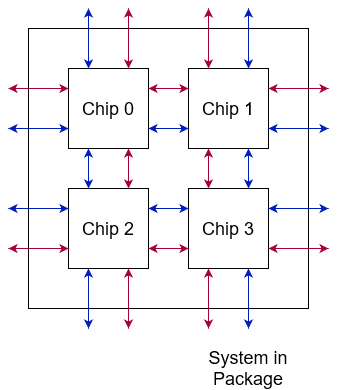
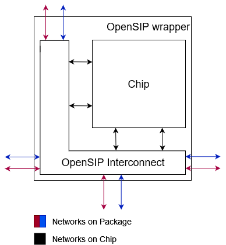
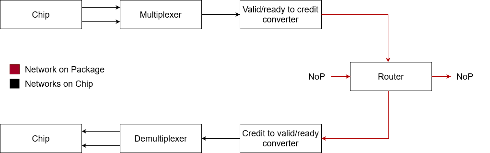
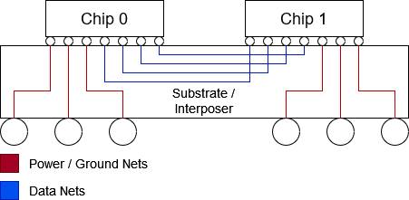

# OpenSIP - open-source System-in-Package routing generator

This repo contains the source code and the documentation for OpenSIP - an open-source System-in-Package (SiP) routing generator. OpenSIP creates the wrapper for the chip of your choice to be later used in SiP.  

OpenSIP creates machinery for routing signals between chips that are arranged in a 2D grid on a package. Users can specify the grid dimensions and the number of Networks on Package (NoPs) depending on the properties of the target SiP platform. The framework then automatically generates the needed interfaces, routers, multiplexers/demultiplexers, and other components from python scripts. For example, the diagram below shows the possible target SiP with a 2x2 grid and 2 independent NoPs. 

## Design

The target chip design is provided by the user. Its inter-chip interface is encapsulated into the NoP packages and routed across the system. The figure below shows an example of a chip with 4 inter-chip interfaces inside the OpenSIP wrapper. The mapping between interfaces and the NoPs is flexible and is defined by the user in [config.json](scripts/config.json). 

The main part of the wrapper is the OpenSIP interconnect. It contains one or more separate parallel pipelines, one for each NoP. The figure below shows the pipeline. Multiple NoCs are first multiplexed into one, and then their flow control is converted into credit-based. The resulting data is fed into the router and sent over the NoP. For received packages, the process is reversed. First, the flow control is converted to valid/ready based, then demultiplexed into multiple NoCs, and finally returned back to the chip. 

## Design considerations

Depending on the substrate or interposer properties, users may want to choose a different number of NoPs or different NoP widths. The figure below shows a typical scheme for 2.5D integration. The number of connections between the chips is mainly determined by the chip area and the substrate/interposer properties. In particular, these properties define the interconnect pitch, the data rate per lane, and the interconnect reach. 

For example, if the user decides to map three 64-bit NoCs directly into three 64-bit NoPs in a 2x2 SiP then each chip has 768 lanes for only inter-chip communication. Each lane requires about 0.25 mm2 in a [typical modern MCM package](https://ieeexplore.ieee.org/document/9365975). For our system, this translates to 384 mm2. Multiplexing all NoCs into one NoP reduces the number of pins to 512 and the area to 128 mm2. 

## Getting started

Specify the parameters of the system in [config.json](scripts/config.json) and run ``make`` in the top directory. Provided [Makefile](Makefile) will generate multiple ``.tmp.v`` files that implement the configured design. Target files are located in [generated](generated) folder.

The current repo contains [config.json](scripts/config.json) with example parameters and the corresponding output in [example](example) folder. 